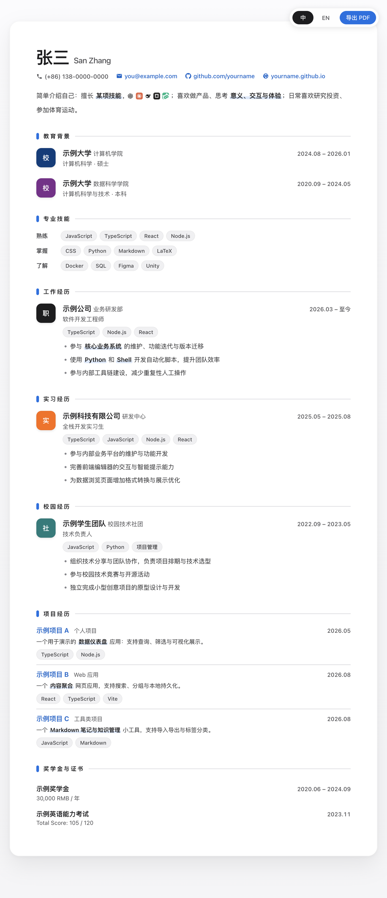

# 简介风简历模板 / Apple-Style Resume Template

一个基于 **JSON + HTML/CSS/JS** 的苹果极简风简历模板。内容与样式分离，日常只需编辑 `resume.json` 即可更新中英文简历；如需深度客制化，再改 `index.html` 中的 CSS / 渲染逻辑。



## 特性
- 苹果极简视觉风格：浅灰背景、白色卡片、SF 字体栈、蓝色强调色
- 中 / EN 一键切换，并记住上次语言
- 数据驱动：所有简历内容集中在 `resume.json`
- 关键词高亮：在文本中用 `**重点内容**` 即可加粗高亮
- 摘要内联图片：设置 `summaryImage`，并在 summary 中使用 `{{image}}` 占位符
- 项目名称支持 GitHub 链接（`href` 字段）
- 悬浮工具栏：语言切换 + 导出 PDF
- 打印版自动紧凑到 1 页；保留背景色、蓝色竖条和分隔线

## 快速开始
1. 编辑 `resume.json`，把你的信息填进去
2. 启动本地服务器（必须用服务器打开，否则 `fetch resume.json` 会被浏览器拦截）：
   - macOS：双击 `start.command`
   - Windows：双击 `start.bat`
   - 或手动运行：
     ```bash
     python3 -m http.server 8765
     ```
     然后打开 `http://127.0.0.1:8765`
3. 在网页右上角切换中英文、导出 PDF

## JSON 结构说明
顶层字段：
- `photo`：页头照片路径，例如 `"photo.jpg"`，`null` 表示不显示
- `summaryImage`：摘要内联图片路径，例如 `"logos/summary-banner.png"`，`null` 表示不显示；需要配合 summary 中的 `{{image}}` 占位符
- `zh` / `en`：中文、英文两份数据，结构一致

`zh` / `en` 内部：
- `name`、`aka`：姓名与别名
- `contacts`：联系信息数组，`icon` 可选 `phone | mail | github | homepage`
- `summary`：摘要，支持 `**加粗**` 和 `{{image}}`
- `education`：教育背景，items 里 `icon` 支持：
  - 文字图标：`{ "text": "校", "color": "#003D7C" }`
  - 图片图标：`{ "img": "logos/school.png" }`
- `skills`：技能分组
- `work`：工作经历
- `internship`：实习经历
- `campus`：校园经历
- `projects`：项目经历，可设置 `href` 作为项目名称超链接
- `awards`：奖学金与证书

经历条目通用字段：`icon`、`org`、`orgSub`、`role`、`period`、`tags`、`bullets`。
项目条目字段：`name`、`href`、`role`、`period`、`tags`、`desc`。

## 客制化
- 主题色、字体、间距：修改 `index.html` 中 `:root` 里的 CSS 变量
- 打印版式：修改 `COMPACT_PRINT_CSS`（紧凑单页打印样式）
- 渲染逻辑：一般不需要改动

## License
MIT
